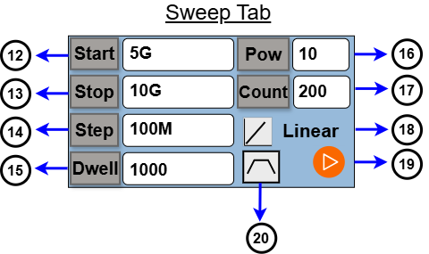
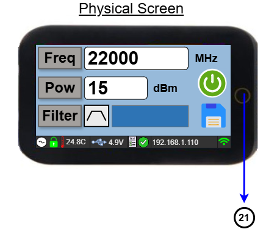

## Overview

The **DSG-22.6 GHz** is a high-performance, portable RF signal generator.  
It tunes continuously from **300 MHz up to 22.6 GHz with 1 Hz resolution**.  

Designed to be compact and cost-effective, it can be powered via USB and operated either in the lab or in the field.  

The generator offers outstanding spectral performance:  
- Harmonic suppression up to **40 dBc at 0 dBm output**  
- Output power adjustable from **+15 dBm down to -50 dBm** in **1 dB steps**  
- Fast frequency tuning in **100 µs**  
- Built-in diagnostics for temperature, voltage/current monitoring, and PLL lock status  

## Features & Technical Specs

| Parameter         | Value / Description |
|-------------------|----------------------|
| Frequency Range   | 0.15 GHz – 22.6 GHz |
| Frequency Resolution | 1 Hz |
| Output Power      | +20 dBm to -15 dBm, 1 dB steps |
| Sweep Mode        | Linear and logarithmic frequency sweep with adjustable start/stop, step size, and dwell time |
| Harmonic Suppression | ≤ 40 dBc (at 0 dBm output) |
| Reference Input   | 10 MHz external, SMA |
| Tuning Speed      | < 100 µs |
| Control Interfaces | touchscreen,USB Type-C,Wi-Fi |
|Built-in diagnostics | Temperature, voltage, current monitor and PLL lock status|
| Power Supply      | USB Type-C, 5 V / 1.5 A |
|Size                | 114 × 60 × 28.2 mm (5.67 × 2.36 × 1.11 in)|
|Weight             | 250 g (8.8 oz)|
|Open source         | Fully open hardware, firmware, and 3D models|

## Output Power
| Output Type | Freq Range | Output Power |
| :--- | :--- | :--- |
| **Filtered Output** | 2 - 18 GHz | 2 - 16 GHz Max 10 to 15 dBm |
| | | 16 - 18 GHz Max 7 to 10 dBm |
| **Unfiltered Output** | 0.15 - 22.6 GHz | 0.15 - 20 GHz Max 17 to 20 dBm |
| | | 20 - 22.6 GHz Max 14 to 18 dBm |

## Hardware & Power Requirements

- Powered by **USB-C** (can run from a laptop, charger, or even a power bank).  
- Standard **SMA RF connector** for output and reference input.  
- Compact, portable enclosure suitable for lab benches or field use.  

## Interfaces & Control

- Capacitive touch display for direct device control 
- **USB control** with SCPI-like command set  
- **Wi-Fi web interface** for browser-based control in the field  

## Touch Display Usage

The device features an integrated touchscreen interface for controlling the DSG. Upon startup, the display defaults to the **Continuous Wave (CW)** tab.

### CW Tab Controls & Indicators

* **1- PLL Lock Status**  
    
  Indicates the Phase-Locked Loop (PLL) lock status.

* **2- PCB Temperature**  
  Displays the live temperature reading of the internal PCB.

* **3- USB Voltage**  
  Displays the input supply voltage provided via USB.

* **4- Built-in Test Result**  
    
  Displays the status and result of the internal Built-in Test (BIT).

* **5- IP Address**  
  Displays the active IP address (Hotspot/AP IP or Client/STA IP depending on the connection mode).

* **6- Wi-Fi Status / Icon**  
    
  Indicates active Wi-Fi connection mode and status.

* **7- Save Button**  
    
  Saves the current output configurations to non-volatile memory.

* **8- RF On/Off Button**  
    
  Toggles the RF output signal ON or OFF.

* **9- Frequency Setting Menu Button**  
    
  Enter the desired frequency value, select the unit (**KHz**, **MHz**, or **GHz**), and tap the green enter button (**↵**) to save.

* **10- Power Settings Menu Button**  
    
  Enter the desired power value (in **dBm**) and tap the green enter button (**↵**) to confirm.

* **11- Filter On/Off**  
    
  Toggles the internal RF filter ON or OFF.

---

### Navigating to the Sweep Tab

To switch from the **Continuous Wave (CW)** tab to the **Sweep** tab, swipe right on the touchscreen display.

### Sweep Tab Controls

* **12- Frequency Start Button**  
  Sets the starting frequency for the sweep.

* **13- Frequency Stop Button**  
  Sets the stop frequency for the sweep.

* **14- Step Button**  
  Sets the frequency step interval for the sweep.

* **15- Dwell Time Button**  
  Sets the dwell time, which determines how long the signal stays at each frequency step during the sweep.

* **16- Power Button**  
  Sets the output power level (in **dBm**) for the sweep operation.

* **17- Count Button**  
  Sets the total number of sweep iterations. Enter `0` for continuous execution.

* **18- Type Button**

   
 **Linear**

   
 **Logarithmic**

 Sets how the sweep frequency progresses between the Start and Stop values. Linear uses a constant frequency step, while Logarithmic increases the frequency by a proportional ratio.

* **19- Sweep Start/Stop Button**  
  Starts or stops the frequency sweep sequence.

* **20- Filter On/Off**  
  Toggles the internal RF filter ON or OFF.
---

### Monitoring Menu Access

Tap the circular touch button on the right side of the display frame to switch to the Monitoring menu.

* **21- Monitoring Menu Button**  
    
  Opens the Monitoring menu to view live system diagnostics and telemetry readings.

---

### Quick Start Summary

1. Install the required libraries: `pip install -r requirements.txt`
2. Connect the DSG to your PC via USB-C (USB-C end into the DSG).
3. Run `python main_gui.py`.
4. In the **Port** dropdown, click **REFRESH**, select the correct port, then click **CONNECT**.
5. Click **LOAD CALIBRATION** and select the calibration file specific to your DSG unit.
6. Use the **CW** tab for a fixed-frequency signal, or the **Sweep** tab to scan across a frequency range.
7. Monitor live device telemetry in the **Device Screen (Live)** panel and diagnostic messages in **System Logs**.

## Demonstration Video

  <a href="https://www.youtube.com/watch?v=-3eZY5avI0c" target="_blank" rel="noopener">
    
     ▶ Watch the Video
  </a>

## Live on Crowd Supply
If you’d like to support the project, it’s now live on Crowd Supply: https://www.crowdsupply.com/atek-midas/dsg-22-6-ghz

## License

This project is licensed under the MIT License.

You are free to use, modify, distribute, and use this project
for personal or commercial purposes, subject to the terms of
the MIT License.

Third-party libraries and components used by this project may
be distributed under their respective licenses.

