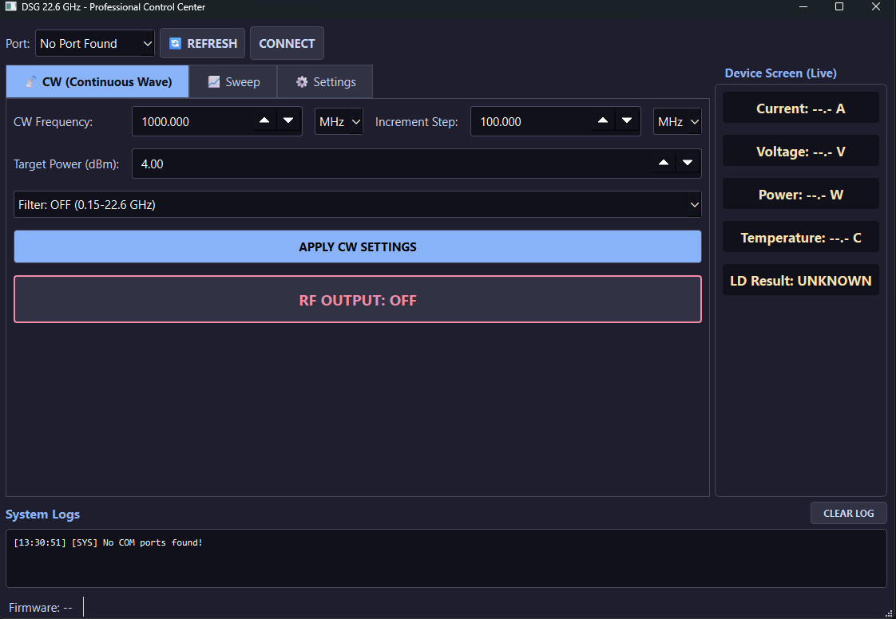
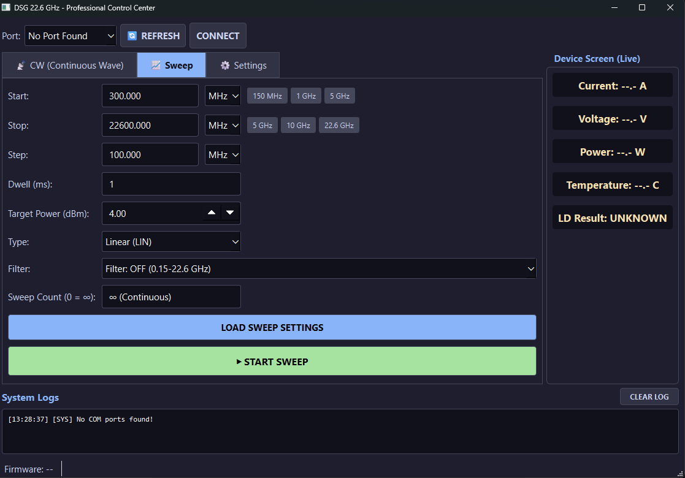
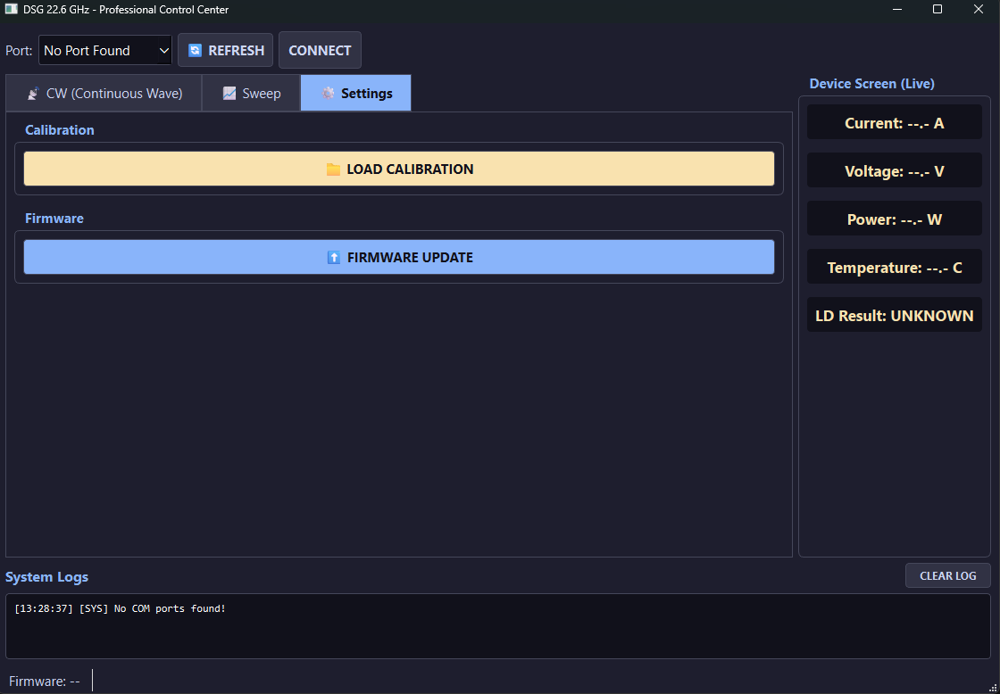

## DSG Control UI (Desktop Application)

A Python-based desktop GUI (**"DSG 22.6 GHz - Professional Control Center"**) is provided to control the DSG signal generator over USB. It lets you generate a continuous-wave (CW) signal at a specific frequency and power, run frequency sweeps, load a device-specific calibration file, and monitor live telemetry (current, voltage, power, temperature, and PLL lock status).

### Requirements

- **Python 3.10 or newer** (developed and tested with Python 3.14.5; other 3.10+ versions are expected to work but have not been explicitly tested)
- A DSG device
- A **USB-C cable**

### Installation

1. Clone or download this repository.
2. Navigate to the UI source folder:
   ```bash
   cd UI
   ```
   *(adjust this path to match the actual folder name in this repo)*
3. (Recommended) Create and activate a virtual environment:
   ```bash
   python -m venv venv
   # Windows
   venv\Scripts\activate
   # macOS/Linux
   source venv/bin/activate
   ```
4. Install the required dependencies:
   ```bash
   pip install -r requirements.txt
   ```

### Required Libraries

| Library | Purpose |
|---|---|
| [`pyserial`](https://pypi.org/project/pyserial/) | Serial (USB) communication with the DSG device |
| [`PyQt6`](https://pypi.org/project/PyQt6/) | Graphical user interface framework |
| [`esptool`](https://pypi.org/project/esptool/) | Flashes ESP32-S3 firmware (.bin) directly from the UI's Firmware Update feature |


*(`sys`, `time`, `datetime`, and `json` are part of the Python standard library and require no separate installation.)*

### Connecting to the Device

1. Connect the DSG device to your PC using a **USB-C cable** — the **USB-C end plugs into the DSG**.
2. Run the main GUI script:
   ```bash
   python main_gui.py
   ```
3. In the top-left **Port** dropdown, click **REFRESH** to scan for available serial ports, then select the port corresponding to your DSG device.
4. Click **CONNECT**. Once connected, the UI and the DSG device are linked and ready for the next step.

---

### CW (Continuous Wave) Tab



The **CW** tab is the default tab shown on startup. It configures the DSG to output a continuous signal at a single, fixed frequency and power level.

| Control | Description |
|---|---|
| **CW Frequency** | The output frequency. Enter the numeric value in the field, then select the unit (**kHz**, **MHz**, or **GHz**) from the dropdown next to it. |
| **Increment Step** | The step size used when incrementing/decrementing the CW Frequency value with the field's up/down arrows. |
| **Target Power (dBm)** | The desired output power level, in dBm. |
| **Filter** | Toggles the internal filter **ON** or **OFF** (see below for the effect of this setting). |
| **APPLY CW SETTINGS** | Sends the configured frequency, power, and filter settings from the UI to the device. The applied settings are also reflected on the DSG's own on-device screen. |
| **RF OUTPUT: OFF / ON** | Toggles the RF output. Click once to switch it to **RF OUTPUT: ON** and start generating the signal; click again to turn it back off. |

**Filter behavior:**
- **Filter: OFF** — allows output across the full **0.15–22.6 GHz** range. However, when the filter is off, the output signal contains visible **harmonics** alongside the fundamental (main) signal.
  <!-- Optional: insert a spectrum screenshot showing the fundamental signal with visible harmonics when Filter is OFF -->
- **Filter: ON** — restricts the usable range to **2–18 GHz**, but suppresses the harmonics by roughly **40 dB**, leaving a clean output with only the fundamental signal present.
  <!-- Optional: insert a spectrum screenshot showing the clean fundamental signal (harmonics suppressed) when Filter is ON -->

**Typical CW workflow:**
1. Enter the desired **CW Frequency** and unit.
2. Set the **Target Power (dBm)**.
3. Choose the **Filter** mode based on your required frequency range and harmonic suppression needs.
4. Click **APPLY CW SETTINGS** to push the configuration to the device.
5. Click **RF OUTPUT: OFF** to turn it **ON** and start generating the signal.

---

### Sweep Tab



The **Sweep** tab configures the DSG to automatically scan across a range of frequencies, from a start frequency to a stop frequency, in defined steps.

| Control | Description |
|---|---|
| **Start** | The frequency at which the sweep begins. Enter the value and select its unit (kHz/MHz/GHz). Quick-select buttons (**150 MHz**, **1 GHz**, **5 GHz**) are provided for common start values. |
| **Stop** | The frequency at which the sweep ends. Quick-select buttons (**5 GHz**, **10 GHz**, **22.6 GHz**) are provided for common stop values. |
| **Step** | The frequency increment used to move from **Start** to **Stop** — i.e. how large each jump is between one sweep point and the next. |
| **Dwell (ms)** | The amount of time, in milliseconds, that the device holds/transmits at each individual frequency step before moving to the next one. |
| **Target Power (dBm)** | The output power level (in dBm) used throughout the sweep. |
| **Type** | The frequency progression mode for the sweep: **Linear (LIN)** or **Logarithmic**. |
| **Filter** | Toggles the internal filter **ON** or **OFF**. |
| **Count** | The number of full sweep cycles (Start → Stop) to run before stopping automatically. Set to **0** to sweep continuously (infinite). |
| **LOAD SWEEP SETTINGS** | Sends the configured sweep parameters (Start, Stop, Step, Dwell, Power, Type,Count) from the UI to the device. |
| **START SWEEP** | Begins the sweep using the most recently loaded settings. |

**Typical Sweep workflow:**
1. Enter the **Start** frequency and unit (or use a quick-select button).
2. Enter the **Stop** frequency and unit (or use a quick-select button).
3. Set the **Step** size — the frequency increment between sweep points.
4. Set the **Dwell (ms)** — how long the device stays on each frequency point.
5. Set the **Target Power (dBm)**.
6. Choose the **Type** (Linear or Logarithmic).
7. Choose the **Filter** mode. (The filter cannot be changed while sweep mode is running.)
8. Choose the **Count**.
9. Click **LOAD SWEEP SETTINGS** to push the configuration to the device.
10. Click **START SWEEP** to begin scanning across the configured frequency range.

---
## Settings Tab



The Settings tab includes 'Load Calibration' and 'Firmware Update' buttons.   

The "Load Calibration" button is used to load a frequency-based calibration file.

### Firmware Update (from the UI)

The **Settings** tab includes a **FIRMWARE UPDATE** button that flashes a `.bin` file to the DSG directly from the UI, using `esptool` — no Arduino IDE required.
 
**Preparing the `.bin` file:**
 
Arduino IDE's "Export Compiled Binary" produces three separate files (bootloader, partition table, application). These must be merged into a single flashable image before using the UI's Firmware Update feature.
 
Run the following command in the folder containing the three exported files:
 
```bash
python -m esptool --chip esp32s3 merge_bin -o merged-firmware.bin --flash-mode keep --flash-freq keep --flash-size keep 0x0 <your-sketch-name>.ino.bootloader.bin 0x8000 <your-sketch-name>.ino.partitions.bin 0x10000 <your-sketch-name>.ino.bin
```
 
> ⚠️ **Important:** Always use `--flash-mode keep --flash-freq keep --flash-size keep` (not explicit values like `qio`/`80m`/`4MB`). Overriding these values manually was found to corrupt the merged image in a way that flashes "successfully" but leaves the device screen blank / device non-functional on boot. Using `keep` preserves the original settings already embedded in the exported files by Arduino IDE, which resolves this.
 
**Flashing:**
 
1. Connect the DSG via USB-C and select its port in the **Port** dropdown.
2. Go to the **Settings** tab and click **FIRMWARE UPDATE**.
3. Select the merged `.bin` file (e.g. `merged-firmware.bin`).
4. Confirm the prompt. Progress is streamed to the System Logs panel.
5. The date and time when the software was installed are displayed in the bottom-left corner of the UI panel.


---

### Device Screen (Live)

Located in the top-right panel, this section displays real-time telemetry read back from the connected DSG device:

- **Current** (A)
- **Voltage** (V)
- **Power** (W)
- **Temperature** (°C)
- **LD Result** — PLL lock detect status (e.g. `UNKNOWN`, `LOCKED`, `UNLOCKED`), indicating whether the internal PLL is successfully locked to the requested frequency.

These values update live while the device is connected, and read `--.-` / `UNKNOWN` when no device is connected.

### System Logs

Located at the bottom of the window, the **System Logs** panel displays timestamped status and diagnostic messages from the application and the device — for example, port/connection status, applied settings confirmations, and device warnings or errors. Use the **CLEAR LOG** button to clear the log view.
